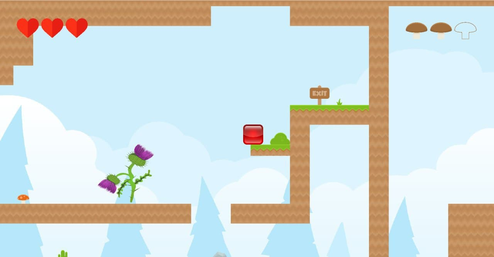

# Jelly.in

**Jelly.in** - игра жанра «платформер», написанная на C++ с использованием
[Qt Framework](https://www.qt.io).
Для обработки движения и столкновений объектов на карте использован физический
движок [Box2D](https://box2d.org).

Это приложение написали четверо студентов факультета прикладной математики и
информатики Белорусского государственного университета в качестве учебного
проекта.

В состав команды входят:
* Войтович Ольга ([@olyavoytovich](https://github.com/olyavoytovich))
* Коган Максим ([@maxim12321](https://github.com/maxim12321))
* Кураш Владислав ([@SubaruFallout](https://github.com/SubaruFallout))
* Поспелова Екатерина ([@kateposp](https://github.com/kateposp))

## Описание игры
Главным героем в игре выступает *«желешка»*, которой требуется пройти n-ое 
кол-во уровней для воссоединения с друзьями. Для прохождения уровня необходимо 
достичь конкретной точки, преодолевая различные препятствия, одолевая монстров
и обходя ловушки.

|  |
| ---------------------------------- |

|  |  |
| ---------------------------------- | ---------------------------------- |

При создании уровней использовалась графика [Kenney](https://kenney.nl).

## Статус разработки
Разработка игры была начата в марте 2020 года.

В папке releases находятся исполняемые файлы программы. С их помощью вы
сможете запустить приложение на 64-битной Windows. Также вы можете
скомпилировать проект на другой ОС, склонировав репозиторий.

Чтобы запустить приложение, запустите исполняемый файл jellyin.exe.    

## Сборка проекта с помощью CMake
Если вы хотите собрать проект в среде разработки Clion, вам для начала
необходимо склонировать репозиторий.
В зависимости от того, на какой операционной системе вы работаете, вам стоит
 прописать одну из следующих строчек в файле CMakeLists.txt:
* `set(CMAKE_PREFIX_PATH "~/Qt/5.13.2/gcc_64/lib/cmake")  # Linux`
* `set(CMAKE_PREFIX_PATH "C:/Qt/Qt5.13.0/5.13.0/mingw73_64/lib/cmake") # Windows`

После этого остается только запустить сборку проекта.

## Сборка проекта с помощью QMake
В случае работы с Qt Creator, вам необходимо собирать проект при помощи QMake.
Это делается несколько проще, чем в случае с CMakeLists. Нужно только
склонировать репозиторий и запустить файл *jellyin.pro*
